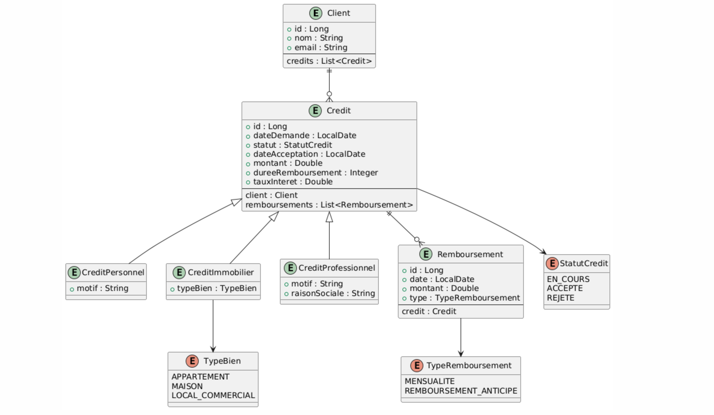

# Frontend and Backend Architecture for Credit Management System

## 1. Introduction

The Credit Management System is a full-stack web application designed to streamline the process of managing client credits and repayments. The system is built using modern technologies and follows best practices in software development.

### Technology Stack

- **Frontend**: Angular 17 (Standalone Components)
- **Backend**: Spring Boot 3.x
- **Database**: MySQL
- **Authentication**: JWT (JSON Web Tokens)
- **Styling**: Tailwind CSS
- **Build Tools**: Maven, npm
- **Version Control**: Git

### Purpose

The application serves as a comprehensive solution for:

- Managing client information
- Processing credit applications
- Tracking credit repayments
- User authentication and role-based access control
- Real-time credit status monitoring

## 2. Project Architecture

The system follows a modern microservices architecture with clear separation of concerns.

### Technical Architecture


### Class Diagram



## 3. Frontend (Angular)

### Component Structure

The frontend is built using Angular's standalone components architecture:

#### Core Components

- **AppComponent**: Main application component with navigation
- **LoginComponent**: Handles user authentication
- **Dashboard Components**:
  - AdminDashboard
  - ClientDashboard
  - EmployeeDashboard

#### Feature Components

- **Client Management**
  - ClientListComponent
  - ClientFormComponent
- **Credit Management**
  - CreditListComponent
  - CreditFormComponent
- **Remboursement Management**
  - RemboursementListComponent
  - RemboursementFormComponent

### Services

- **AuthService**: Handles authentication and JWT management
- **ClientService**: Manages client-related operations
- **CreditService**: Handles credit operations
- **RemboursementService**: Manages repayment operations

### UI Screenshots

#### Authentication


#### Client Management


#### Credit Management


#### Remboursement Management


#### Dashboard Views


## 4. Backend (Spring Boot)

### Architecture Layers

1. **Controller Layer**

   - AuthenticationController
     - POST /api/auth/login
     - POST /api/auth/register
   - ClientController
     - GET /api/clients
     - GET /api/clients/{id}
     - POST /api/clients
     - PUT /api/clients/{id}
     - DELETE /api/clients/{id}
   - CreditController
     - GET /api/credits
     - GET /api/credits/{id}
     - GET /api/credits/client/{clientId}
     - POST /api/credits
     - PUT /api/credits/{id}
     - DELETE /api/credits/{id}
   - RemboursementController
     - GET /api/remboursements
     - GET /api/remboursements/{id}
     - GET /api/remboursements/credit/{creditId}
     - POST /api/remboursements
     - PUT /api/remboursements/{id}
     - DELETE /api/remboursements/{id}

2. **Service Layer**

   - ClientService
     - CRUD operations for clients
     - Client validation
     - Credit history retrieval
   - CreditService
     - CRUD operations for credits
     - Credit calculation
     - Payment schedule generation
   - RemboursementService
     - CRUD operations for remboursements
     - Payment tracking
     - Balance calculation
   - AuthenticationService
     - User authentication
     - JWT token management
     - Password encryption

3. **Repository Layer**
   - ClientRepository
     - JPA repository for client operations
   - CreditRepository
     - JPA repository for credit operations
   - RemboursementRepository
     - JPA repository for remboursement operations

### Key Features

- RESTful API endpoints
- JWT-based authentication
- Role-based authorization
- Data validation and error handling
- Transaction management
- Exception handling
- Logging and monitoring
- CORS configuration
- Swagger documentation

## 5. Database Design

### Entity Relationships

- **Client**: One-to-Many relationship with Credit
- **Credit**: One-to-Many relationship with Remboursement
- **User**: Base entity for authentication

### Tables

1. **clients**

   - id (PK, BIGINT)
   - nom (VARCHAR)
   - prenom (VARCHAR)
   - email (VARCHAR, UNIQUE)
   - telephone (VARCHAR)
   - created_at (TIMESTAMP)
   - updated_at (TIMESTAMP)

2. **credits**

   - id (PK, BIGINT)
   - montant (DECIMAL)
   - taux (DECIMAL)
   - duree (INT)
   - dateDebut (DATE)
   - client_id (FK, BIGINT)
   - status (VARCHAR)
   - created_at (TIMESTAMP)
   - updated_at (TIMESTAMP)

3. **remboursements**

   - id (PK, BIGINT)
   - montant (DECIMAL)
   - dateRemboursement (DATE)
   - credit_id (FK, BIGINT)
   - status (VARCHAR)
   - created_at (TIMESTAMP)
   - updated_at (TIMESTAMP)

4. **users**
   - id (PK, BIGINT)
   - username (VARCHAR, UNIQUE)
   - password (VARCHAR)
   - role (VARCHAR)
   - created_at (TIMESTAMP)
   - updated_at (TIMESTAMP)

## 6. Communication Flow

### Frontend-Backend Communication

1. **Authentication Flow**

   - User submits credentials
   - Backend validates and returns JWT
   - Frontend stores JWT for subsequent requests
   - JWT included in Authorization header

2. **Data Operations**
   - HTTP GET for retrieving data
   - HTTP POST for creating new records
   - HTTP PUT for updating existing records
   - HTTP DELETE for removing records
   - Error handling and status codes
   - Response data formatting

### API Endpoints

```
/api/auth/*
/api/clients/*
/api/credits/*
/api/remboursements/*
```

## 7. Role Management and Authorization

### User Roles

1. **ADMIN**

   - Full system access
   - User management
   - System configuration
   - View all clients and credits
   - Manage all remboursements

2. **CLIENT**

   - View own credits
   - View own repayments
   - Update personal information
   - Request new credits

3. **EMPLOYE**
   - Process credit applications
   - Manage repayments
   - View client information
   - Generate reports
   - Handle client queries

### Security Implementation

- Role-based route guards
- JWT token validation
- Secure password hashing
- CORS configuration
- Request validation

## 8. Conclusion

The Credit Management System demonstrates a well-structured, secure, and scalable application architecture. The separation of concerns between frontend and backend, along with proper implementation of security measures, makes it a robust solution for credit management.
